# Cover Page

# AI Vendor Discovery & Recommendation Engine: Consolidated Technical Manual
**Technical Handover and Systems Engineering Documentation**
**Version:** v1.0.0  
**Date:** June 25, 2026  
**Author:** Technical Systems Architect / Engineering Handover Team  
**Workspace:** `apurv-stack/vendor-recommendation-ai-engine`

---

# Table of Contents
1. [Cover Page](#cover-page)
2. [Revision History](#revision-history)
3. [Executive Summary](#executive-summary)
4. [Business Objective](#business-objective)
5. [Technology Stack](#technology-stack)
6. [High Level Architecture](#high-level-architecture)
7. [Complete System Architecture](#complete-system-architecture)
8. [Agentic AI Workflow](#agentic-ai-workflow)
9. [LangGraph Processing Pipeline](#langgraph-processing-pipeline)
10. [Recommendation Engine](#recommendation-engine)
11. [Ranking & Scoring System](#ranking-scoring-system)
12. [Database Design](#database-design)
13. [ERD Explanation](#erd-explanation)
14. [Authentication & Authorization](#authentication-authorization)
15. [Session Management](#session-management)
16. [Vendor Synchronization Engine](#vendor-synchronization-engine)
17. [Vendor Cleanup & Audit Engine](#vendor-cleanup-audit-engine)
18. [API Reference](#api-reference)
19. [Deployment Architecture](#deployment-architecture)
20. [Security Architecture](#security-architecture)
21. [Monitoring & Logging](#monitoring-logging)
22. [Technical Challenges](#technical-challenges)
23. [Optimizations Implemented](#optimizations-implemented)
24. [Future Enhancements](#future-enhancements)
25. [Conclusion](#conclusion)

---

# Revision History

Below is the changelog mapping the document modifications, verification audits, and schema updates:

| Version | Date | Author | Description |
| :--- | :--- | :--- | :--- |
| **v1.0.0** | 2026-06-25 | Technical Systems Architect | Consolidated modular technical documentation files into one master technical manual. Incorporated all corrections from `diagram_audit_report.md` and `final_verification_report.md`. Corrected ERD table mappings (adding `categories` and `vendor_services`), adjusted the `conversations.session_id` constraint, standardized route prefixes to `/vendors/service`, documented Swagger login endpoint `/auth/token`, and embedded the complete dark/light SVG diagram suite. |

---

# Executive Summary

The **AI Vendor Discovery & Recommendation Engine** is an intelligent conversational search, matchmaking, and evaluation platform. It allows clients to search, filter, rank, and compare vendor profiles (e.g., caterers, DJs, venue hosts, photographers, decorators) using unstructured natural language.

Traditional marketplace directories rely on rigid, dropdown-heavy search filters. This system implements a stateful agentic reasoning loop using **FastAPI**, **PostgreSQL**, and **LangGraph**. The system leverages:
1. **Local Parameter Extraction:** A local **Ollama** service (running the `qwen2.5:7b` model) parses unstructured user queries to extract filters (city, category, guest capacity, pricing boundaries).
2. **Contextual History Tracking:** A thread-safe, memory-locked caching session system compiles dialogue sequences and updates missing search criteria.
3. **Multi-Agent Execution Pipeline:** LangGraph coordinates supervisor, context, analyzer, discovery, tool-calling, ranking, comparison, and response nodes.
4. **Weighted Suitability Scoring:** An algorithm scores and ranks candidates using category-tailored criteria weights and availability priorities.
5. **Data Quality Operations:** Automated daemons run periodic spreadsheet data ingestion synchronization and audit database records for duplicates and format anomalies.
6. **High-Speed Conversational Response:** A remote **Groq Cloud** API (`llama3-8b-8192`) translates raw candidate matrices and comparison cards into friendly, warm responses.

This manual serves as the primary system design reference and internship handover documentation.

---

# Business Objective

In the event management and hospitality industries, matching clients with vendor profiles is a manual and time-consuming process. Planners spend hours filtering directory catalogs based on locations, budgets, rating averages, and service types.

The **AI Vendor Discovery Engine** automates matchmaking via an intuitive conversational interface:
* **Fuzzy Parsing:** Interprets natural language statements (e.g., "I need a budget photographer in Mumbai who does candid shots") and translates them into database queries.
* **Proactive Interceptions:** Detects incomplete queries and prompts the user for missing fields (such as city or category) to establish search parameters before querying the database.
* **Category-Tailored Scoring:** Emphasizes different parameters based on category (e.g., location proximity for venues, price boundaries for caterers, average ratings for decorators).
* **Head-to-Head Comparisons:** Resolves comparison queries by presenting structured metrics and winner/loser verdicts based on prices, ratings, and verifications.
* **Continuous Integrity:** Runs background tasks to identify duplicate records, formatting issues, and price inconsistencies.

---

# Technology Stack

The platform is built using a cloud-native, Python-centric technology stack:

* **Backend API Framework:** **FastAPI (v0.100+)**
  * *Rationale:* High-performance asynchronous execution, Pydantic data validation, auto-generated OpenAPI documentation, and dependency injection.
* **Database & ORM:** **PostgreSQL** with **SQLAlchemy ORM (v2.0+)**
  * *Rationale:* Transactional safety, GIN indexing for JSONB context data, and type-safe SQLAlchemy 2.0 object-relational mapping.
* **Database Migration tool:** **Alembic**
  * *Rationale:* Version-controlled schema migrations.
* **Agentic Framework:** **LangGraph** and **LangChain**
  * *Rationale:* Coordinates multi-agent workflows as state machines. Manages states, node transitions, and conditional routing.
* **AI Orchestration & Providers:**
  * **Ollama (Local - Qwen 2.5:7b):** Primary engine for query understanding, intent extraction, and parameter parsing. Kept local to preserve user data privacy.
  * **Groq Cloud (Remote - Llama 3-8b-8192):** Generates fast, conversational summaries and comparative responses.
  * *Note:* All references to Gemini and ModelScope have been removed, as the application uses local Ollama and remote Groq.
* **Background Scheduler:** **APScheduler (Advanced Python Scheduler)**
  * *Rationale:* In-process daemon for database synchronization and cleanup tasks.

---

# High Level Architecture

The codebase is organized using clean architecture principles, dividing responsibilities into distinct layers:

1. **API Router Layer (FastAPI):** Exposes endpoints, validates input payloads, and verifies JWT tokens.
2. **Service Layer (Business Logic):** Handles core features, session context generation, sheet uploads, and admin operations.
3. **Reasoning Graph Layer (LangGraph):** Orchestrates multi-agent node steps and manages `AgentState`.
4. **Repository Layer (Data Access):** Executes optimized database queries using SQLAlchemy `joinedload` techniques to prevent N+1 queries.
5. **Database Layer (PostgreSQL):** Stores relational schemas and JSONB conversation details.
6. **Integration Layer (LLM API Clients):** Manages connection clients for Ollama and Groq.

---

# Complete System Architecture

The following diagrams illustrate the relationship between the Vite Frontend UI, the FastAPI Application Server, the PostgreSQL database, local Ollama, and the remote Groq Cloud API:

### High-Level System Architecture - Light Mode
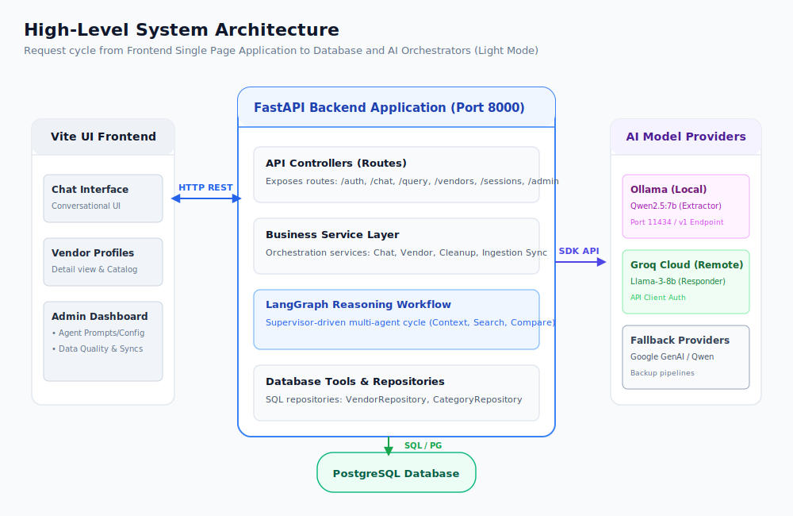

### High-Level System Architecture - Dark Mode
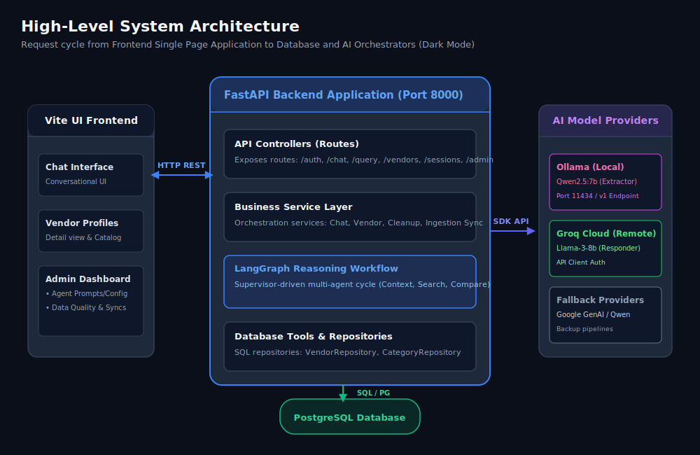

---

# Agentic AI Workflow

The conversational reasoning loop is structured using **LangGraph**, compiling nodes into an acyclic state machine:


#### Light Mode:


#### Dark Mode:


---

# LangGraph Processing Pipeline

### LangGraph Workflow Diagrams

#### Light Mode:


#### Dark Mode:


### Shared State Definition (`AgentState`)
The `AgentState` is a shared dictionary passed between agents. It contains the following keys:
* **Request Context:** `query` (str), `session_id` (str), `user_id` (str), `db` (Session), `access_token` (str | None).
* **Routing Metadata:** `intent` (str), `secondary_intents` (List[str]), `confidence` (float).
* **Constraint Extraction:** `filters` (Dict[str, Any] containing category, city, budget, guest count), `validation` (Dict[str, Any]), `search_payload` (Dict[str, Any]).
* **Database & Tool Outputs:** `tool_name` (str), `tool_input` (Dict[str, Any]), `tool_output` (Dict[str, Any]), `tool_status` (str), `tool_error` (str | None), `vendors` (List[Any]), `ranked_vendors` (List[Any]).
* **Workflow Trace:** `current_agent` (str), `workflow_trace` (List[Dict[str, Any]]), `errors` (List[str]), `ai_response` (str).

### Node Specifications
* **`supervisor` (in [app/agents/supervisor_agent.py](app/agents/supervisor_agent.py)):** Determines query intent. If intent is resolved upstream by the router, it bypasses LLM classification to minimize latency. Otherwise, it calls `IntentExtractor`.
* **`context` (in [app/agents/context_agent.py](app/agents/context_agent.py)):** Loads user preference history and the last 10 messages. Bypasses database queries for simple greetings.
* **`query_analysis` (in [app/agents/query_analysis_agent.py](app/agents/query_analysis_agent.py)):** Parses filters (category, city, budget, guest count) using system prompt templates from the database and local Ollama.
* **`tool_calling` (in [app/agents/tool_calling_agent.py](app/agents/tool_calling_agent.py)):** Invokes tool executors. Catches database failures to update state.
* **`discovery` (in [app/agents/discovery_agent.py](app/agents/discovery_agent.py)):** Fetches matching vendors, applying limits from database configurations.
* **`ranking` (in [app/agents/ranking_agent.py](app/agents/ranking_agent.py)):** Passes vendor datasets and weights to `RecommendationEngine.rank_vendors`.
* **`comparison` (in [app/agents/comparison_agent.py](app/agents/comparison_agent.py)):** Handles head-to-head comparisons. Resolves spelling variations using word-intersection checks.
* **`response` (in [app/agents/response_agent.py](app/agents/response_agent.py)):** Generates client responses (including tables and comparison summaries) using Groq.
* **`error` (in [app/agents/error_agent.py](app/agents/error_agent.py)):** Outputs user-friendly fallback error messages.

### Routing Logic
The graph uses conditional routers to transition between nodes:
* **`route_from_supervisor`:** Checks `state["intent"]`.
  * If search-related (`'vendor_search'`, `'vendor_recommendation'`, `'pricing_query'`, `'service_query'`, `'session_query'`), routes to `context`.
  * If `'comparison_query'`, routes to `comparison`.
  * Otherwise, routes to `response`.
* **`route_after_analysis`:** Checks filters.
  * If `'comparison_query'`, routes to `comparison`.
  * If discovery-related, routes to `tool_calling`.
* **`route_after_tool_calling`:**
  * If `'session_query'`, routes to `response`.
  * If discovery-related, routes to `discovery`.

---

# Recommendation Engine

The recommendation engine ranks candidate vendors based on multi-dimensional relevance. Once matching vendors are returned from the database, they are scored using a weighted algorithm.

The system calculates seven sub-scores, applies category-specific weights, adds verification bonuses, and applies availability metrics to generate a final suitability score (0-100%).

### Recommendation Scoring Pipeline Diagrams

#### Light Mode:
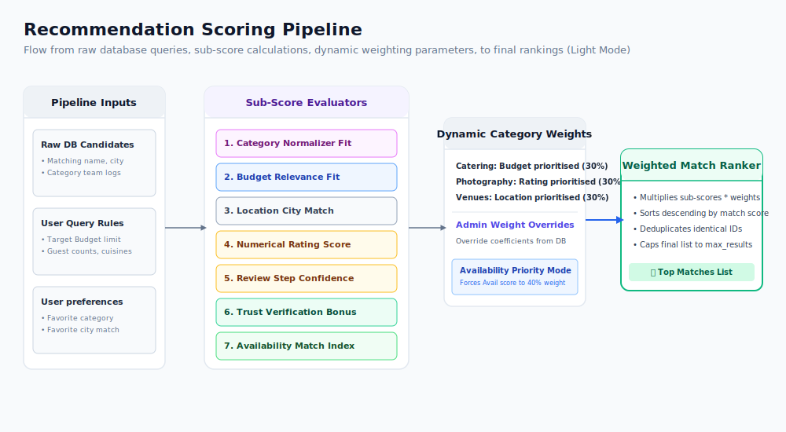

#### Dark Mode:
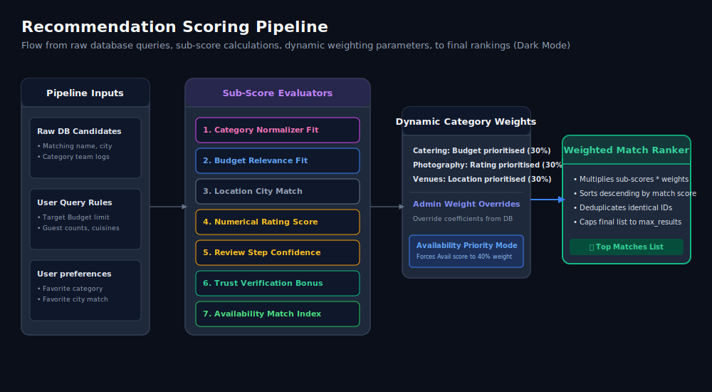

---

# Ranking & Scoring System

### Core Formula
The final suitability score for a vendor is computed using a weighted sum of seven sub-scores:

$$\text{Final Score} = \sum (\text{Sub-Score}_i \times \text{Weight}_i)$$

$$\text{Final Score} = (\text{Category} \times W_{cat}) + (\text{Budget} \times W_{bud}) + (\text{Location} \times W_{loc}) + (\text{Rating} \times W_{rat}) + (\text{Reviews} \times W_{rev}) + (\text{Verified} \times W_{ver}) + (\text{Available} \times W_{av})$$

The final score is rounded to the nearest integer and capped at 100%.

### Sub-Score Computations
1. **Category Fit Score (0-100):** Synonym checks mapping equivalent terms (e.g. "photo", "videographer" to canonical `'photography'`). Returns 100 for exact matches, 75 for partial matches, 60 for keyword description matches, and 0 for mismatches.
2. **Budget Relevance Score (0-100):** Evaluates pricing compatibility:
   * If budget lies within $[Price_{min}, Price_{max}]$: Returns 100.
   * Max price under budget (affordable undershoot): Returns 80 (within 20% margin) or 60.
   * Min price over budget (overshoot): Returns 70 (within 10% overshoot), 40 (within 25%), 20 (within 50%), or 0.
3. **Location Score (0 or 100):** Binary check. Returns 100 if the vendor's city matches the query city, else 0.
4. **Rating Score (0-100):** Normalizes average ratings: $(\text{Average Rating} / 5.0) \times 100$.
5. **Review Count Score (10-100):** Confidence indexing: $\ge 200 \rightarrow 100$, $\ge 100 \rightarrow 80$, $\ge 50 \rightarrow 60$, $\ge 20 \rightarrow 40$, $> 0 \rightarrow 20$, $0 \rightarrow 10$.
6. **Verification Score (0 or 100):** Returns 100 if verified, else 0.
7. **Availability Score (0-100):** Returns 100 if available, 0 if unavailable, and 50 if unspecified.

### Category-Specific Weights

| Category | $W_{cat}$ (Category) | $W_{bud}$ (Budget) | $W_{loc}$ (Location) | $W_{rat}$ (Rating) | $W_{rev}$ (Reviews) | $W_{ver}$ (Verified) | $W_{av}$ (Available) |
| :--- | :---: | :---: | :---: | :---: | :---: | :---: | :---: |
| **`default`** | 35% | 20% | 15% | 15% | 10% | 3% | 2% |
| **`photography`**| 25% | 10% | 10% | 30% | 20% | 3% | 2% |
| **`catering`** | 25% | 30% | 10% | 15% | 15% | 3% | 2% |
| **`venue`** | 25% | 20% | 30% | 12% | 8% | 3% | 2% |
| **`decoration`** | 25% | 15% | 10% | 28% | 17% | 3% | 2% |
| **`dj`** | 25% | 15% | 10% | 28% | 17% | 3% | 2% |
| **`entertainment`**| 25% | 12% | 10% | 30% | 18% | 3% | 2% |
| **`music`** | 25% | 12% | 10% | 30% | 18% | 3% | 2% |

### Dynamic Overrides
Administrators can override scoring weights via the admin dashboard. The custom weights are fetched from database configuration settings. If the **Availability Priority** option is enabled, the availability weight is increased to 40% (ranking available vendors first) while reducing rating weights to balance the equation.

### Duplicate Filtering
To prevent duplicate listings in recommendation outputs:
* **Database Grouping:** SQL queries in `search_vendors` group results by `Vendor.vendor_id` to ensure unique vendor rows are returned.
* **Hierarchical Deduplication:** De-duplicates category-team listings, showing parent company profiles rather than listing individual sub-teams.

---

# Database Design

The relational database is built using PostgreSQL. Relations are modeled via SQLAlchemy ORM (using Python type annotations).

### Database ERD Diagrams

#### Light Mode:
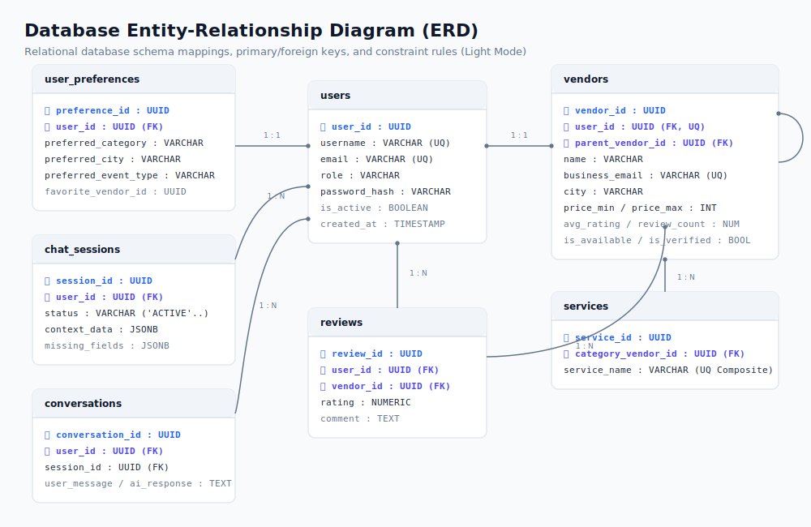

#### Dark Mode:
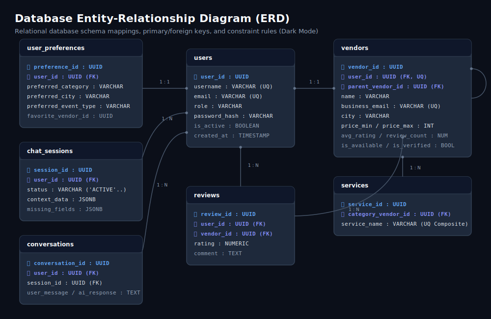

---

# ERD Explanation

### Core Table Definitions & Constraints

#### 1. `users` (Model: `User` in [app/models/user.py](app/models/user.py))
* **Primary Key:** `user_id` (UUID, Default: `uuid4`)
* **Unique Constraints:** `username`, `email`
* **Check Constraints:** 
  * `check_full_name`: `length(trim(full_name)) > 0`
  * `check_username`: `length(trim(username)) > 0`
  * `check_email`: `length(trim(email)) > 0`
  * `check_phone`: `phone_number IS NULL OR length(trim(phone_number)) > 0`
  * `check_role`: `role IN ('user','vendor','admin')`

#### 2. `categories` (Model: `Category` in [app/models/category.py](app/models/category.py))
* **Primary Key:** `category_id` (UUID, Default: `uuid4`)
* **Unique Constraints:** `name`, `slug`
* **Fields:** `name` (String, nullable=False), `slug` (String, nullable=False), `description` (Text, nullable=True), `is_active` (Boolean, default=True), `created_at` (DateTime), `updated_at` (DateTime).

#### 3. `vendors` (Model: `Vendor` in [app/models/vendor.py](app/models/vendor.py))
* **Primary Key:** `vendor_id` (UUID, Default: `uuid4`)
* **Foreign Keys:** 
  * `user_id` $\rightarrow$ `users.user_id` (Unique, Nullable)
  * `parent_vendor_id` $\rightarrow$ `vendors.vendor_id` (Self-referencing hierarchy link, Nullable)
  * `category_id` $\rightarrow$ `categories.category_id` (Nullable)
* **Check Constraints:**
  * `check_vendor_name`: `length(trim(name)) > 0`
  * `check_business_email`: `length(trim(business_email)) > 0`
  * `check_contact_phone`: `length(trim(contact_phone)) > 0`
  * `check_price_min`: `price_min IS NULL OR price_min >= 0`
  * `check_price_max`: `price_max IS NULL OR price_max >= 0`
  * `check_price_order`: `(price_min IS NULL OR price_max IS NULL) OR (price_min <= price_max)`
  * `check_rating`: `avg_rating >= 0 AND avg_rating <= 5`
  * `check_review_count`: `review_count >= 0`

#### 4. `services` (Model: `Service` in [app/models/service.py](app/models/service.py))
* **Primary Key:** `service_id` (UUID, Default: `uuid4`)
* **Foreign Key:** `category_vendor_id` $\rightarrow$ `vendors.vendor_id` (Cascade delete)
* **Unique Constraint:** `unique_service_per_category` on (`category_vendor_id`, `service_name`)

#### 5. `vendor_services` (Model: `VendorService` in [app/models/vendor_service.py](app/models/vendor_service.py))
* **Primary Key:** `service_id` (UUID, Default: `uuid4`)
* **Foreign Key:** `vendor_id` $\rightarrow$ `vendors.vendor_id` (Nullable=False)
* **Check Constraints:**
  * `check_service_name`: `length(trim(service_name)) > 0`
  * `check_service_price`: `price IS NULL OR price >= 0`
* **Fields:** `service_name` (String, nullable=False), `description` (Text, nullable=True), `price` (Integer, nullable=True), `is_active` (Boolean, default=True), timestamps.

#### 6. `chat_sessions` (Model: `ChatSession` in [app/models/chat_session.py](app/models/chat_session.py))
* **Primary Key:** `session_id` (UUID, Default: `uuid4`)
* **Foreign Key:** `user_id` $\rightarrow$ `users.user_id`
* **Fields:** `status` (String, default=`'ACTIVE'`), `context_data` (JSONB), `missing_fields` (JSONB).
* **Indexes:** 
  * `idx_chat_session_user` on `user_id`
  * `idx_chat_session_status` on `status`

#### 7. `conversations` (Model: `Conversation` in [app/models/conversation.py](app/models/conversation.py))
* **Primary Key:** `conversation_id` (UUID, Default: `uuid4`)
* **Foreign Key:** `user_id` $\rightarrow$ `users.user_id` (Nullable=False)
* **Session ID Column:** `session_id` (UUID, Nullable=False) - *Note: No database-level ForeignKey constraint exists on this column to optimize write operations. It is indexed and handled at the service layer.*
* **Metadata Fields (JSONB & Text):**
  * `detected_intent` (String, nullable=True)
  * `applied_filters` (Text, nullable=True)
  * `is_follow_up` (Boolean, default=False)
  * `context_summary` (Text, nullable=True)
  * `recommendations` (JSONB, nullable=True)
* **Indexes:** 
  * `idx_conversation_session` on `session_id`
  * `idx_conversation_user` on `user_id`
  * `idx_conversation_intent` on `detected_intent`
  * `idx_conversation_user_created` on (`user_id`, `created_at`)

#### 8. `user_preferences` (Model: `UserPreference` in [app/models/user_preference.py](app/models/user_preference.py))
* **Primary Key:** `preference_id` (UUID, Default: `uuid4`)
* **Foreign Keys:**
  * `user_id` $\rightarrow$ `users.user_id` (Unique)
  * `favorite_vendor_id` $\rightarrow$ `vendors.vendor_id`
* **Indexes:**
  * `idx_user_preference_category` on `preferred_category`
  * `idx_user_preference_vendor` on `favorite_vendor_id`

#### 9. `reviews` (Model: `Review` in [app/models/review.py](app/models/review.py))
* **Primary Key:** `review_id` (UUID, Default: `uuid4`)
* **Foreign Keys:**
  * `user_id` $\rightarrow$ `users.user_id`
  * `vendor_id` $\rightarrow$ `vendors.vendor_id` (Cascade delete)
* **Fields:** `rating` (Float, nullable=False), `comment` (Text), timestamps.

---

# Authentication & Authorization

The system enforces signed **JWT Access Tokens** and rotation cookies:
1. **Access Token:** Short-lived JWT (15 minutes). Exchanged in the HTTP headers:
   `Authorization: Bearer <JWT_ACCESS_TOKEN>`
2. **Refresh Token:** Long-lived token (7 days). Set by the server in a secure, `HttpOnly`, `Secure`, `SameSite=Lax` cookie. Automatically read at the `/auth/refresh` endpoint to rotate access tokens.
3. **Role Checks:** Injectable route dependencies enforce role restrictions: `user`, `vendor`, and `admin`.

### Authentication & Token Rotation Sequence Diagrams

#### Light Mode:
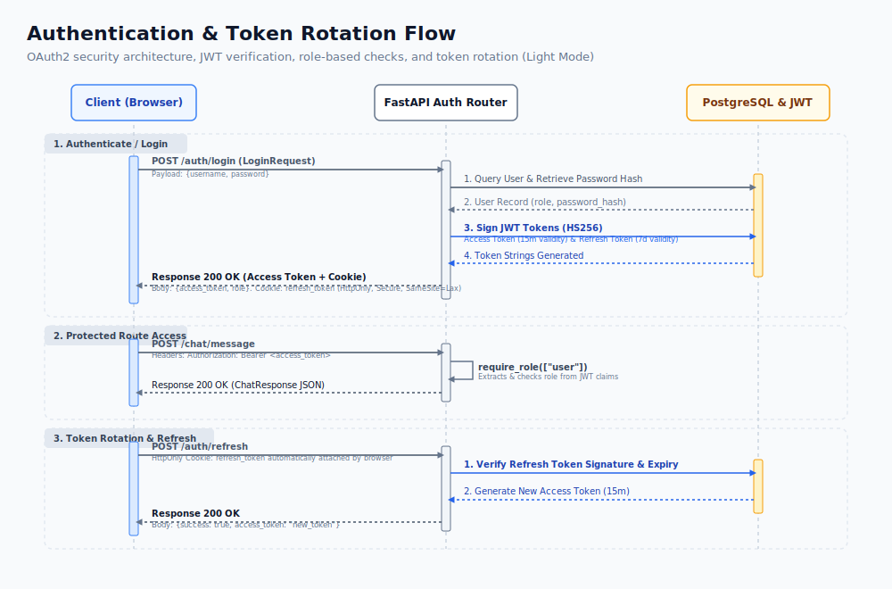

#### Dark Mode:
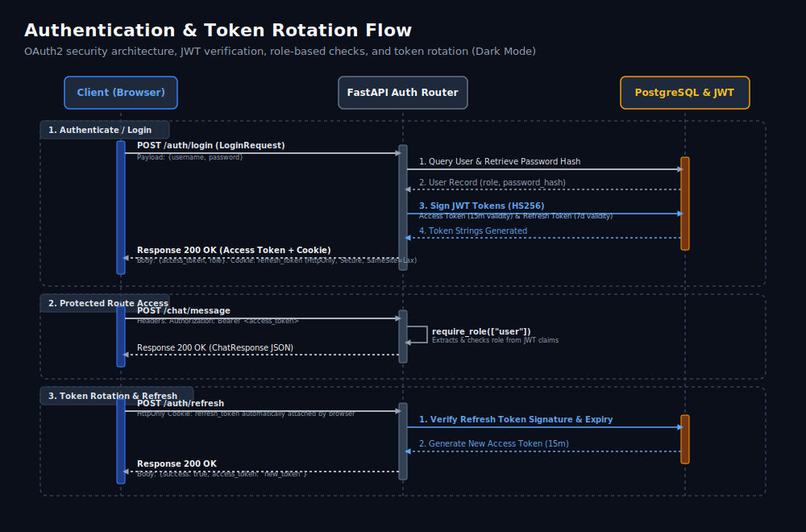

---

# Session Management

The conversation session flow manages active user states:

### Chat Session Lifecycle Diagrams

#### Light Mode:
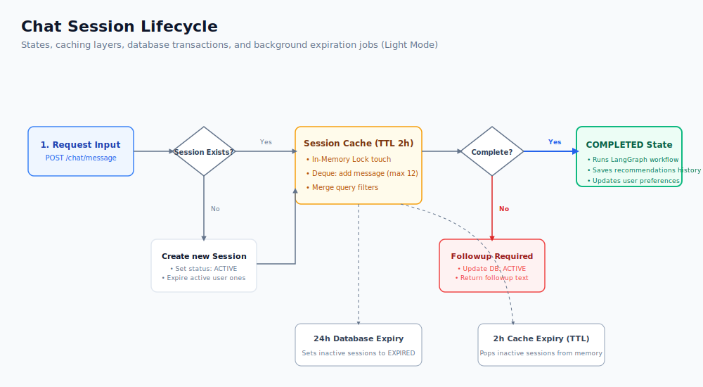

#### Dark Mode:
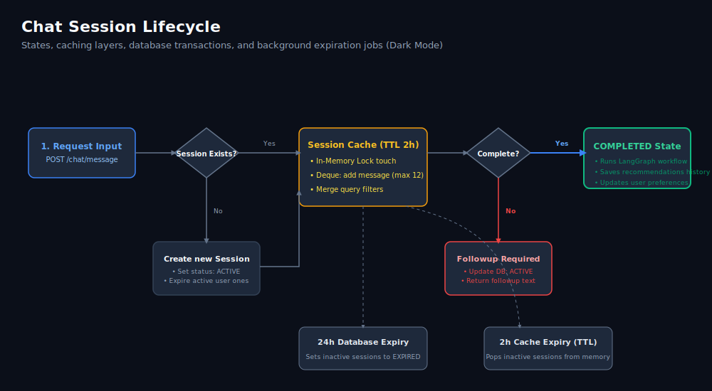

### Lifecycle Design
* **Creation:** Triggers when a POST request is sent to `/chat/message` with a new `session_id`. If a session is missing, it closes older active sessions for the user and creates a new `ChatSession` record. **Older active sessions are marked as `"COMPLETED"` (not `"EXPIRED"`) to ensure isolation.**
* **Update:** Dialogues are saved to the `conversations` table, and extracted filters are merged with `ChatSession.context_data` JSONB parameters.
* **Expiration:** Cache records use a thread-safe cleanup routine with a 2-hour TTL sliding window. A background scheduler runs database updates to mark PostgreSQL sessions inactive for over 24 hours as `"EXPIRED"`.
* **Persistence:** Histories are stored in PostgreSQL to support multi-device syncing, and preferences are saved in the `user_preferences` table.

---

# Vendor Synchronization Engine

The backend utilizes **APScheduler** to execute periodic background operations.

### Database Ingestion Sync Pipeline (`VendorSyncService`)
* **Execution Interval:** Scheduled to run every 30 minutes.
* **Operations:** Reads external vendor records, validates required fields (name, email, phone), and retries failed syncs up to 3 times.
* **Logging:** Saves results to `SyncJobRun` and errors to `SyncActivityLog`.

---

# Vendor Cleanup & Audit Engine

### Database Quality Audit & Cleanup Pipeline (`VendorCleanupService`)
* **Anomalies Checked:** Runs quality audits to flag duplicates (matching name-email or name-phone pairs), validate email formats, check phone numbers, check for missing cities, and identify pricing errors ($Price_{min} > Price_{max}$).
* **Review Cycle:** Audit logs are saved to `VendorCleanupLog` with a `'pending'` status. Administrators can review logs and update their status to `'reviewed'`, `'resolved'`, or `'ignored'`.
* **Metrics:** Scans are recorded in `VendorCleanupReport` to track metrics like total scanned profiles, issues detected, and issues resolved.

### Sync & Cleanup Workflow Diagrams

#### Light Mode:
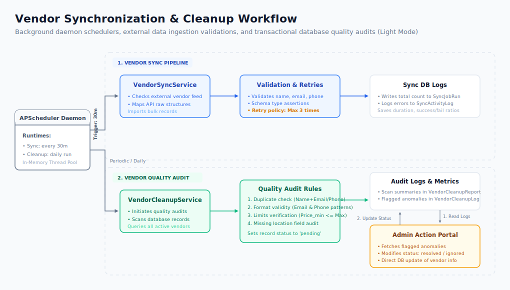

#### Dark Mode:
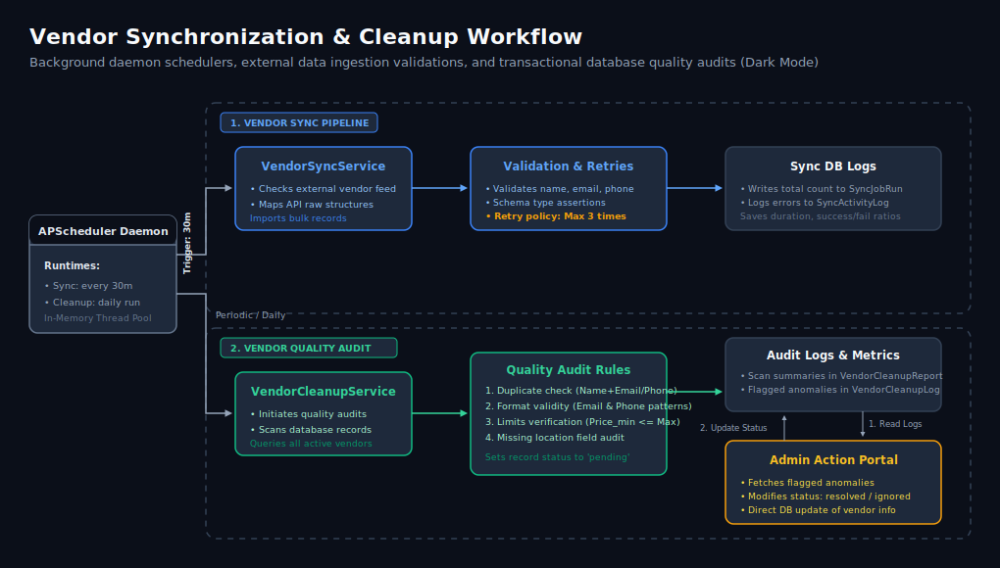

---

# API Reference

### 1. Authentication Router (`/auth`)

* **POST `/auth/register`**
  * *Purpose:* Registers a new user or vendor account.
  * *Auth Required:* Public (None)
  * *Request Schema:* `RegisterRequest`
    * `username` (str, required): 3–30 chars, alphanumeric.
    * `full_name` (str, required): 2–100 chars.
    * `email` (str, required): Valid email string.
    * `password` (str, required): 8–100 chars.
    * `confirm_password` (str, required): Must match `password` exactly.
    * `role` (str, optional, default: `"user"`): `"user"` or `"vendor"`.
    * `business_email` (str, optional): Required for vendors.
    * `phone_number` (str, optional): Required for vendors.
  * *Response Schema:* `RegisterResponse`
    * `success` (bool): `true` if registered.
    * `message` (str): Status message.
    * `user` (object): User details metadata.
  * *Example Request:*
    ```json
    {
      "username": "jane_doe",
      "full_name": "Jane Doe",
      "email": "jane@example.com",
      "password": "Password123!",
      "confirm_password": "Password123!",
      "role": "user"
    }
    ```
  * *Example Response:*
    ```json
    {
      "success": true,
      "message": "User registered successfully",
      "user": {
        "user_id": "d3b07384-d113-49cd-a5d6-8cf815f94d9a",
        "username": "jane_doe",
        "full_name": "Jane Doe",
        "email": "jane@example.com",
        "role": "user"
      }
    }
    ```

* **POST `/auth/login`**
  * *Purpose:* Authenticates credentials and sets HTTP refresh token cookie.
  * *Auth Required:* Public (None)
  * *Request Schema:* `LoginRequest`
    * `identifier` (str, required): Username or email.
    * `password` (str, required): Verification password.
  * *Response Schema:* `LoginResponse`
    * `success` (bool): `true` if logged in.
    * `message` (str): Status message.
    * `access_token` (str): Access token JWT.
    * `token_type` (str): `"bearer"`.
  * *Response Cookie:* `Set-Cookie: refresh_token=<REFRESH_JWT>; HttpOnly; Secure; SameSite=Lax; Max-Age=604800`

* **POST `/auth/refresh`**
  * *Purpose:* Renews access tokens using the refresh cookie.
  * *Auth Required:* Public (HttpOnly cookie check)
  * *Response Schema:* `access_token` (str), `token_type` (`"bearer"`).

* **POST `/auth/logout`**
  * *Purpose:* Clears the refresh token cookie and invalidates session.
  * *Auth Required:* Public

* **POST `/auth/token`**
  * *Purpose:* OAuth2 password form endpoint used by Swagger for authentication.
  * *Auth Required:* Public (Form inputs)

* **GET `/auth/check-username/{username}`**
  * *Purpose:* Instantly checks if a username is available.
  * *Auth Required:* Public

* **GET `/auth/check-email/{email}`**
  * *Purpose:* Instantly checks if an email is registered.
  * *Auth Required:* Public

* **GET `/auth/me`**
  * *Purpose:* Resolves the current user's profile metadata.
  * *Auth Required:* Bearer Token

---

### 2. Conversational Chat Router (`/chat`)

* **POST `/chat/message`**
  * *Purpose:* Main conversational chat interface.
  * *Auth Required:* Bearer Token
  * *Request Schema:* `ChatRequest`
    * `message` (str, required): 1-500 characters.
    * `session_id` (str, optional): Existing chat session UUID.
  * *Response Schema:* `ChatResponse`
    * `success` (bool): `true` if successful.
    * `message` (str): Dialogue response text.
    * `session_id` (str): Active session UUID.
    * `response_type` (str): `"chat"`, `"validation_error"`, or `"error"`.
    * `current_question` (str | None): Question about missing search criteria.
    * `missing_fields` (list): Fields still required (e.g. `["city", "category"]`).
    * `recommendations` (list): Matching candidate cards.

---

### 3. Query Parsing Router (`/query`)

* **POST `/query/preprocess`**
  * *Purpose:* Normalizes query strings.
  * *Auth Required:* Bearer Token
  * *Request Schema:* `query` (str).
  * *Response Schema:* `normalized_query` (str).

* **POST `/query/understand`**
  * *Purpose:* Returns extracted intents and filters using rule-based parsers.
  * *Auth Required:* Bearer Token

* **POST `/query/ai-understand`**
  * *Purpose:* Triggers the LLM-driven structured filter extractor.
  * *Auth Required:* Bearer Token

---

### 4. AI Interactive Router (`/ai`)

* **POST `/ai/chat`**
  * *Purpose:* Runs sandboxed prompts from templates, bypassing graph state.
  * *Auth Required:* Bearer Token
  * *Request Schema:* `query` (str), `workflow` (optional, default: `"vendor"`).

---

### 5. Category Registry Management (`/categories`)

* **POST `/categories/`**
  * *Purpose:* Creates a new service category.
  * *Auth Required:* Bearer Token (Admin only)
  * *Request Schema:* `name` (str), `slug` (str), `description` (str | None).

* **GET `/categories/`**
  * *Purpose:* Lists all active categories.
  * *Auth Required:* Public

* **GET `/categories/{category_id}`**
  * *Purpose:* Retrieves a single category.
  * *Auth Required:* Public

* **PATCH `/categories/{category_id}`**
  * *Purpose:* Updates category properties.
  * *Auth Required:* Bearer Token (Admin only)

* **DELETE `/categories/{category_id}`**
  * *Purpose:* Soft-deactivates a category.
  * *Auth Required:* Bearer Token (Admin only)

---

### 6. Chat Session Router (`/sessions`)

* **GET `/sessions`**
  * *Purpose:* Lists user sessions with pagination offsets.
  * *Auth Required:* Bearer Token

* **GET `/sessions/{session_id}`**
  * *Purpose:* Retrieves session parameters and missing fields.
  * *Auth Required:* Bearer Token

* **GET `/sessions/{session_id}/history`**
  * *Purpose:* Chronological message logs for a session.
  * *Auth Required:* Bearer Token

* **GET `/sessions/{session_id}/context`**
  * *Purpose:* AI-generated summary of session preferences.
  * *Auth Required:* Bearer Token

* **PATCH `/sessions/{session_id}`**
  * *Purpose:* Renames the session title.
  * *Auth Required:* Bearer Token

* **DELETE `/sessions/{session_id}`**
  * *Purpose:* Deletes a session and its conversational history.
  * *Auth Required:* Bearer Token

---

### 7. Vendor Directory & Profiles (`/vendors`)

* **GET `/vendors/profile`**
  * *Purpose:* Retrieves the active vendor's business profile.
  * *Auth Required:* Bearer Token (Vendor only)

* **PUT `/vendors/profile`**
  * *Purpose:* Updates the vendor business profile.
  * *Auth Required:* Bearer Token (Vendor only)

* **PUT `/vendors/{vendor_id}/rename`**
  * *Purpose:* Renames a vendor business name.
  * *Auth Required:* Bearer Token (Vendor owner or Admin)

* **POST `/vendors/team`**
  * *Purpose:* Creates a specialty sub-team nested under the root vendor profile.
  * *Auth Required:* Bearer Token (Vendor only)

* **GET `/vendors/internal-team`**
  * *Purpose:* Returns sub-teams nested under the active vendor profile.
  * *Auth Required:* Bearer Token (Vendor only)

* **GET `/vendors/{vendor_id}/children`**
  * *Purpose:* Public retrieval of sub-teams nested under a parent vendor ID.
  * *Auth Required:* Public

* **GET `/vendors/service/{service_id}`**
  * *Purpose:* Retrieves a single service detail.
  * *Auth Required:* Public

* **PUT `/vendors/service/{service_id}/rename`**
  * *Purpose:* Renames a specific service.
  * *Auth Required:* Bearer Token (Vendor owner or Admin)

* **DELETE `/vendors/service/{service_id}`**
  * *Purpose:* Removes a service from the catalog.
  * *Auth Required:* Bearer Token (Vendor owner or Admin)

* **GET `/vendors/search`**
  * *Purpose:* Search endpoint with filtering and pagination.
  * *Auth Required:* Public

* **GET `/vendors/recommendations`**
  * *Purpose:* Returns candidate vendors matching user preferences.
  * *Auth Required:* Bearer Token

* **GET `/vendors/preferences/me` | PUT `/vendors/preferences/me`**
  * *Purpose:* Manages user search preferences.
  * *Auth Required:* Bearer Token

* **POST `/vendors/import`**
  * *Purpose:* Ingests vendor profile listings (JSON payload).
  * *Auth Required:* Bearer Token (Admin only)

* **POST `/vendors/import-file`**
  * *Purpose:* Ingests vendor listings from CSV/Excel files.
  * *Auth Required:* Bearer Token (Admin only)

* **PATCH `/vendors/{vendor_id}/verify`**
  * *Purpose:* Verification status toggle.
  * *Auth Required:* Bearer Token (Admin only)

* **PATCH `/vendors/{vendor_id}/reject`**
  * *Purpose:* Flags a vendor profile as rejected.
  * *Auth Required:* Bearer Token (Admin only)

* **PATCH `/vendors/{vendor_id}/restore`**
  * *Purpose:* Restores deactivated/rejected vendor profiles.
  * *Auth Required:* Bearer Token (Admin only)

* **GET `/vendors/admin/stats`**
  * *Purpose:* Administrative analytics overview.
  * *Auth Required:* Bearer Token (Admin only)

---

### 8. AI Agent Administration (`/admin/agents`)

* **GET `/admin/agents` | POST `/admin/agents`**
  * *Purpose:* Lists and creates reasoning agent nodes.
  * *Auth Required:* Bearer Token (Admin only)

* **GET `/admin/agents/{agent_id}`**
  * *Purpose:* Details for a specific reasoning agent.
  * *Auth Required:* Bearer Token (Admin only)

* **PATCH `/admin/agents/{agent_id}/status`**
  * *Purpose:* Toggles active/inactive status of an agent.
  * *Auth Required:* Bearer Token (Admin only)

* **GET `/admin/agents/{agent_id}/prompt` | PUT `/admin/agents/{agent_id}/prompt`**
  * *Purpose:* Manages agent prompt versions.
  * *Auth Required:* Bearer Token (Admin only)

* **GET `/admin/agents/{agent_id}/config` | PUT `/admin/agents/{agent_id}/config`**
  * *Purpose:* Runtime parameter configs (e.g. model name, temperature, timeouts).
  * *Auth Required:* Bearer Token (Admin only)

* **GET `/admin/agents/{agent_id}/versions`**
  * *Purpose:* Lists version logs for the system prompts.
  * *Auth Required:* Bearer Token (Admin only)

* **POST `/admin/agents/{agent_id}/rollback/{version_id}`**
  * *Purpose:* Rolls back agent prompts to previous versions.
  * *Auth Required:* Bearer Token (Admin only)

* **GET `/admin/agents/{agent_id}/audit-logs`**
  * *Purpose:* Lists audit logs for the agent.
  * *Auth Required:* Bearer Token (Admin only)

---

### 9. Vendor Quality Audit & Cleanup (`/admin/vendor-cleanup`)

* **GET `/admin/vendor-cleanup/dashboard`**
  * *Purpose:* Statistics of quality audit issues.
  * *Auth Required:* Bearer Token (Admin only)

* **POST `/admin/vendor-cleanup/run`**
  * *Purpose:* Triggers database quality audits.
  * *Auth Required:* Bearer Token (Admin only)

* **GET `/admin/vendor-cleanup/reports` | DELETE `/admin/vendor-cleanup/reports/{run_id}`**
  * *Purpose:* Manages execution reports.
  * *Auth Required:* Bearer Token (Admin only)

* **GET `/admin/vendor-cleanup/logs` | PATCH `/admin/vendor-cleanup/logs/{log_id}/status`**
  * *Purpose:* Manages audit logs.
  * *Auth Required:* Bearer Token (Admin only)

---

### 10. Vendor Ingestion & Synchronization (`/admin/vendor-sync`)

* **GET `/admin/vendor-sync/dashboard`**
  * *Purpose:* Ingestion sync dashboard stats.
  * *Auth Required:* Bearer Token (Admin only)

* **POST `/admin/vendor-sync/run`**
  * *Purpose:* Forces an immediate background ingestion sync run.
  * *Auth Required:* Bearer Token (Admin only)

* **GET `/admin/vendor-sync/runs`**
  * *Purpose:* Lists historical execution logs of ingestion sync jobs.
  * *Auth Required:* Bearer Token (Admin only)

* **GET `/admin/vendor-sync/logs`**
  * *Purpose:* Lists detailed sync errors.
  * *Auth Required:* Bearer Token (Admin only)

---

### 11. LangGraph Pipeline Execution (`/reasoning`)

* **POST `/reasoning/test`**
  * *Purpose:* Executes the LangGraph agent state graph synchronously and returns complete tracing metrics for debugging queries.
  * *Auth Required:* Bearer Token

---

# Deployment Architecture

The platform uses a modular, cloud-native architecture:
* **Vite Frontend UI:** Serves static assets compiled with `npm run build` via Nginx (port `5173` in development).
* **FastAPI Application Server:** Executed via Uvicorn/Gunicorn. It runs on port `8000`, exposes API endpoints, and drives background task processing.
* **PostgreSQL Database:** The transactional data store (port `5432`).
* **Local AI Engine (Ollama):** A local service running on port `11434` hosting the `qwen2.5:7b` model. Used for parsing query intents and extracting parameter filters.
* **Remote Response Generator (Groq):** A remote API provider hosting `llama3-8b-8192`. Fast token generation is used to summarize search results and explain head-to-head comparisons.

---

# Security Architecture

* **JWT signature configurations:** Configured with `SECRET_KEY` and the `HS256` signing algorithm. Access tokens are valid for 15 minutes, and refresh tokens are valid for 7 days.
* **HttpOnly Cookies:** Refresh tokens are written to client browsers via secure, HttpOnly cookies with `SameSite=lax` policies. This protects the tokens from XSS-based theft.
* **Access Token Rotation Flow:**
   1. The client requests a token refresh at `/auth/refresh`.
   2. The server reads the HttpOnly cookie and validates the refresh token.
   3. The server generates a new temporary access token and returns it in the response body.
* **Role Verification Dependency:** Injectable dependencies (`require_role(["admin"])` and `require_role(["vendor"])`) validate scopes before executing route actions.

---

# Monitoring & Logging

* **Request Logging Middleware:** The server uses `RequestLoggingMiddleware` to intercept every incoming API call. It logs the HTTP method, path, response status code, and request duration in milliseconds.
* **Audit Logs:** Schema modifications, prompt changes, and system rollbacks write audit records to the `AgentAuditLog` database table. This helps track administrative operations.
* **Data Ingestion logs:** Sync runs write execution statistics (success ratios, failed items) to `SyncJobRun` and `SyncActivityLog` tables for easy debugging.

---

# Technical Challenges

* **Ollama Latency and Timeout:** Running heavy LLM models locally can be slow. If prompts are too long, Ollama slows down dramatically. Solved by capping prompt lengths to 3000 characters for sandbox runs and utilizing Groq Cloud as the high-speed response agent.
* **Stateful Conversational Flows:** Maintaining filters across messages requires a dual-layer caching strategy. Resolving comparison requests requires caching previous candidate lists in `SessionManager`.
* **N+1 Query Operations:** Database queries on nested entities (vendors, sub-teams, service price lists) could cause database performance bottlenecks. Solved by implementing SQLAlchemy `joinedload` on relationships.
* **Transactional Data Cleaning:** Bulk sync feeds can ingest bad data. Solved by wrapping sync in transaction scopes, logging job runs, and designing the separate audit/cleanup pipeline to flag price limits, formats, and duplicates.

---

# Optimizations Implemented

* **Selective Caching:** The `ToolCallingAgent` caches category-city searches for 5 minutes, avoiding duplicate database queries for identical queries. Incomplete searches bypass the cache to ensure the user receives appropriate follow-up questions.
* **Model Warmups:** Lifespan starts up in the background and warms up Ollama by generate-pinging the model on port 11434 with `keep_alive` set to `10m`.
* **Fuzzy Match Logic:** Direct word-intersection scoring matches user queries to actual vendor profile names.

---

# Future Enhancements

* **Vector Search (Semantic Embedding):** Implement pgvector to match user requirements to vendor descriptions using semantic similarity embeddings.
* **Real-time Webhook Ingestions:** Transition from 30-minute periodic sync runs to webhook-based event streams for real-time catalog updates.
* **Interactive Admin Sandbox:** Visual UI sandbox allowing admins to test prompts, inspect traces, and roll back prompt versions.

---

# Conclusion

The **AI Vendor Discovery & Recommendation Engine** represents a modern approach to business matchmaking. By combining local private NLP parsing via **Ollama** with high-speed remote generation via **Groq**, the system achieves low latency, high relevance, and strong data integrity. The clean layering of services, state graphs, database transactions, and background audits ensures the platform remains scalable, secure, and easy to maintain.
