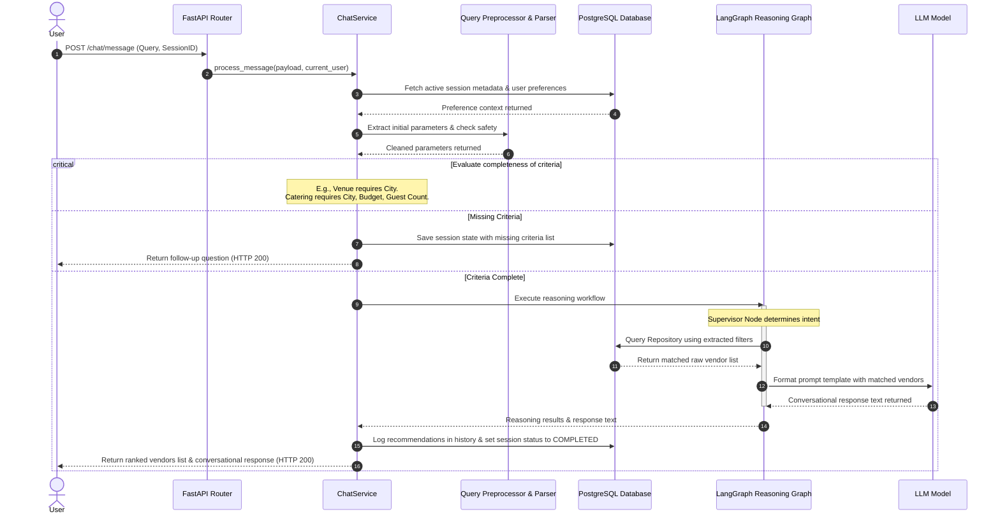

# AI Vendor Recommendation & Discovery Engine: Documentation Blueprint

This blueprint outlines the technical architecture, modules, database design, AI components, and data flow of the backend engine for the **AI Vendor Discovery Agent API**. It provides a roadmap for generating the complete, production-grade technical documentation.

---

## 1. Business Purpose
The **AI Vendor Discovery & Recommendation Engine** is an intelligent conversational platform designed to match event planners and clients with the ideal service vendors (e.g., caterers, photographers, venue hosts, decorators, DJs) based on multi-dimensional criteria. 
Unlike static search portals, this engine:
* **Engages in Conversational Discovery:** Uses an interactive chat interface to gather preferences naturally over a session.
* **Auto-Extracts Constraints:** Parses fuzzy, natural language inputs to isolate hard constraints (e.g., location, budget limits, cuisines, guest counts, service categories).
* **Implements Agentic Reasoning:** Employs a multi-agent LangGraph workflow to supervisor-route requests, analyze user context, call database search tools, resolve comparisons, and rank results.
* **Applies Weighted Category-Specific Rankings:** Computes vendor suitability matching scores using algorithms tailored to specific categories (e.g., prioritizing locations for venues, pricing for caterers, and ratings for photographers).
* **Ensures Data Integrity:** Runs background data-cleansing jobs to flag price range inconsistencies, duplicate entries, invalid contact details, and missing values.

---

## 2. Functional Modules
The engine is split into nine primary functional modules:
1. **User Authentication & Identity Management:** Supports secure registration, login, role assignments (`user`, `vendor`, `admin`), and JWT-based session refreshments via HttpOnly cookies.
2. **Vendor Profile & Hierarchy Registry:** Handles profile registration, multi-tier nesting (mapping parent vendor companies to sub-teams/specialties), and specific service records.
3. **Conversational Chat Orchestration:** Manages conversational state, determines when to prompt the user for missing criteria, and persists dialogue history.
4. **Natural Language Query Parser:** Normalizes raw query inputs, flags injection risks, extracts filters using rule-based and LLM-assisted extractors, and infers user intents.
5. **Agentic Reasoning Graph (LangGraph Workflow):** Orchestrates multi-agent pipelines where specialized nodes handle Context retrieval, Query Analysis, Database Tool Calling, Vendor Comparisons, Ranking, and Response generation.
6. **Recommendation & Ranking Scoring Engine:** Calculates compatibility indices for matched vendors using category-tailored weights and budget tolerance curves.
7. **Background Sync & External Ingestion Scheduler:** Periodically pulls vendor data from external sources, validates integrity rules, tracks sync jobs, and records execution metrics.
8. **Vendor Audit & Quality Cleanup:** An administrator module that scans profiles, flags duplicates, reports price range discrepancies, and detects invalid emails/phones.
9. **Admin Dashboard Configurations:** Allows administrators to modify model scoring weights, active provider targets (Ollama vs. Groq vs. Gemini), and session timeouts.

---

## 3. Folder Structure Analysis
Below is the structural breakdown of the backend directory (`/backend/app`):

```
backend/
├── alembic/                      # Database migration scripts and environment setups
├── app/
│   ├── agents/                   # LangGraph agent definitions (Supervisor, Context, Query Analysis, etc.)
│   ├── ai/                       # NLP pipeline, LLM factory, structured parsers, recommendation engine
│   │   ├── prompts/              # Loaded system prompt configurations
│   │   └── providers/            # Vendor LLM api integrations
│   ├── api/                      # REST endpoints and request dependencies
│   │   ├── dependencies/         # Security, user context, and database session injection
│   │   └── routes/               # API Router groups (auth, vendor, chat, query, reasoning)
│   ├── core/                     # Application configurations, exceptions, security, and validators
│   ├── db/                       # SQLAlchemy connection initialization and database session factory
│   ├── graphs/                   # LangGraph workflow compile setups, routing routers, and state definitions
│   ├── integrations/             # External integration API clients
│   ├── models/                   # SQLAlchemy ORM schemas mapped to PostgreSQL tables
│   ├── repositories/             # Database access queries (VendorRepository, CategoryRepository)
│   ├── schemas/                  # Pydantic serialization models for API boundaries
│   ├── scripts/                  # Utility and seeding scripts
│   ├── services/                 # Business logic services (ChatService, VendorService, SyncService, etc.)
│   ├── tools/                    # Registered database query tools executed by agents
│   └── utils/                    # Shared helper functions
└── requirements/                 # Dependency lists for environment setups
```

---

## 4. API Modules
The platform exposes REST APIs structured using FastAPI router groups:

| Router Prefix | Route Path | HTTP Method | Description |
| :--- | :--- | :--- | :--- |
| **`/auth`** | `/register` | POST | Registers a new user, vendor, or administrator. |
| | `/login` | POST | Authenticates credentials and drops a secure HttpOnly Refresh token cookie. |
| | `/refresh` | POST | Decodes the refresh cookie and issues a new temporary Access JWT. |
| | `/logout` | POST | Invalidates the session by clearing the refresh token cookie. |
| | `/check-username/{username}` | GET | Instantly checks if a username is available. |
| | `/check-email/{email}` | GET | Instantly checks if an email is registered. |
| | `/me` | GET | Returns the profile of the currently authenticated token holder. |
| **`/chat`** | `/message` | POST | The main endpoint for interactive queries. Accepts queries and processes through LangGraph. |
| **`/query`** | `/preprocess` | POST | Normalizes spelling and formats queries (primarily for debugging). |
| | `/understand` | POST | Runs rule-based intent extraction, filters, and outputs search payloads. |
| | `/ai-understand` | POST | Triggers the LLM-driven structured filter extractor. |
| **`/vendor`**| `/profile` | POST / PUT | Creates or modifies root vendor organization metadata. |
| | `/team` | POST | Creates a hierarchical sub-team (e.g. Catering specialty) under a parent vendor. |
| | `/service` | POST / PUT / DELETE| Manages specific price item listings linked to sub-teams. |
| | `/import` | POST | Performs bulk uploads from spreadsheet documents. |
| **`/session`**| `/` | GET / DELETE | Lists, deletes, or clears chat sessions. |
| **`/reasoning`**| `/test` | POST | Directly executes and logs the workflow trace of a LangGraph execution. |
| **`/admin/cleanup`**| `/run` | POST | Invokes the vendor data consistency cleaner. |
| **`/admin/sync`**| `/run` | POST | Forces synchronization from external client APIs. |

---

## 5. Service Layer Components
The service layer encapsulates business processes, separating HTTP routing from database persistence:

1. **`ChatService` (in [chat_service.py](file:///C:/Users/kashish/Desktop/Intern/vendor-recommendation-ai-engine/backend/app/services/chat_service.py)):**
   * Orchestrates the conversation flow. If it detects predefined phrases, it returns quick replies.
   * Pulls chat histories, formats conversation summaries, and manages active/completed database states.
   * Intercepts comparison queries, routes to the `ReasoningGraph`, and catches database-level API failures to return fallback error payloads.
2. **`VendorService` (in [vendor_service.py](file:///C:/Users/kashish/Desktop/Intern/vendor-recommendation-ai-engine/backend/app/services/vendor_service.py)):**
   * Implements validation rules for business registrations (phones, pricing limits, email constraints).
   * Manages hierarchical sub-team nesting levels (ensures sub-teams are linked to parent organizations).
   * Handles stream parsing for spreadsheet records, validating cells in bulk before execution.
3. **`VendorCleanupService` (in [vendor_cleanup_service.py](file:///C:/Users/kashish/Desktop/Intern/vendor-recommendation-ai-engine/backend/app/services/vendor_cleanup_service.py)):**
   * Performs programmatic audits. Identifies identical name-email or name-phone pairs, invalid emails, empty phone records, and logical pricing errors ($Price_{min} > Price_{max}$).
   * Generates audit records and persists metadata log summaries.
4. **`VendorSyncService` (in [vendor_sync_service.py](file:///C:/Users/kashish/Desktop/Intern/vendor-recommendation-ai-engine/backend/app/services/vendor_sync_service.py)):**
   * Integrates external vendor sources. Wraps transactions in retry limits (3 attempts per record) and logs success/failure statuses.
5. **`SchedulerService` (in [scheduler_service.py](file:///C:/Users/kashish/Desktop/Intern/vendor-recommendation-ai-engine/backend/app/services/scheduler_service.py)):**
   * Runs an APScheduler background scheduler to execute `VendorSyncService` every 30 minutes.
6. **`ChatSessionService` (in [chat_session_service.py](file:///C:/Users/kashish/Desktop/Intern/vendor-recommendation-ai-engine/backend/app/services/chat_session_service.py)):**
   * Modifies sessions in PostgreSQL, handles page offsets, completes workflows, and runs cleanup loops to expire active sessions idle for over 24 hours.
7. **`ConversationService` (in [conversation_service.py](file:///C:/Users/kashish/Desktop/Intern/vendor-recommendation-ai-engine/backend/app/services/conversation_service.py)):**
   * Records dialogues, structures filters applied to messages, and compiles the context summaries injected into LLM calls.
8. **`UserPreferenceService` (in [user_preference_service.py](file:///C:/Users/kashish/Desktop/Intern/vendor-recommendation-ai-engine/backend/app/services/user_preference_service.py)):**
   * Analyzes successful chat sessions to extract user preferences, saving preferred cities and categories to customize future recommendations.

---

## 6. Repository Layer Components
The repository layer acts as a gateway for database operations, avoiding raw query leakage inside business logic:

1. **`VendorRepository` (in [vendor_repository.py](file:///C:/Users/kashish/Desktop/Intern/vendor-recommendation-ai-engine/backend/app/repositories/vendor_repository.py)):**
   * Exposes methods like `create_root_vendor`, `create_vendor`, `get_vendor_by_id`, and `get_all_vendors`.
   * **`search_vendors`:** The core query engine. It runs SQL joins across `Vendor`, aliases of child category vendors (`CategoryVendor`), matching catalog records (`Service`), and ratings (`Review`).
   * Handles string match patterns, arrays of categories mapped to synonyms, budget range overlaps ($Vendor.price\_min \le Query.max\_price$), city matches, ratings, and pagination limits.
2. **`CategoryRepository` (in [category_repository.py](file:///C:/Users/kashish/Desktop/Intern/vendor-recommendation-ai-engine/backend/app/repositories/category_repository.py)):**
   * Evaluates canonical categories and checks database records before insert actions.

---

## 7. Database Models
The relational database layout is built using SQLAlchemy ORM mapping to PostgreSQL. The schema consists of the following key tables:

* **`User` (`app/models/user.py`):** User accounts. Stores usernames, emails, hashed passwords, contact details, and role enums (`user`, `vendor`, `admin`).
* **`Vendor` (`app/models/vendor.py`):** The primary vendor profile. Self-references via `parent_vendor_id` to establish organizational hierarchies (Root Vendor $\rightarrow$ Specialty/Category Sub-team Vendors). Stores location details (city, address), average ratings, review counts, engagement stats (views, follows), and active status flags.
* **`Service` (`app/models/service.py`):** Services offered (e.g., "Buffet Setup", "Candid Photography"). Linked directly to a sub-team vendor.
* **`PricingModel` (`app/models/pricing_model.py`):** Complex price lists, tiers, custom deposits, and currencies.
* **`Review` (`app/models/review.py`):** User reviews containing numerical ratings, descriptions, moderation flags, and timestamps.
* **`UserPreference` (`app/models/user_preference.py`):** User search preferences (preferred city, minimum rating, target category, and event type).
* **`ChatSession` (`app/models/chat_session.py`):** Session records. Houses current questionnaire states, active/completed status flags, and lists of missing criteria needed from users.
* **`Conversation` (`app/models/conversation.py`):** Transcripts of dialogues, mapping user inputs to assistant responses along with snapshot JSON representations of applied filters and recommendations.
* **`RecommendationHistory` & `RecommendationMetadata` (`app/models/recommendation_history.py` & `recommendation_metadata.py`):** Audits of generated recommendations, capturing matching scores and user click-through events.
* **`VendorMedia` (`app/models/vendor_media.py`):** Media uploads (photos, portfolios, promotional videos).
* **`SemanticEmbedding` (`app/models/semantic_embedding.py`):** Vector representation values for semantic searches.
* **`VendorCleanupReport` & `VendorCleanupLog` (`app/models/vendor_cleanup_report.py` & `vendor_cleanup_log.py`):** Admin logs recording duplicate entities and validation issues.
* **`SyncJobRun` & `SyncActivityLog` (`app/models/sync_job_run.py` & `sync_activity_log.py`):** Tracks scheduler execution, attempts, and failures.

---

## 8. AI Components
The intelligence layer uses NLP heuristics combined with structured LLM queries:

* **`LLMFactory` (in [llm_factory.py](file:///C:/Users/kashish/Desktop/Intern/vendor-recommendation-ai-engine/backend/app/ai/llm_factory.py)):**
   * Configures client connections to Groq, Gemini, Ollama, and ModelScope.
   * Manages distinct client wrappers for fast extraction runs and high-quality human response formatting.
* **`QueryPreprocessor` (in [query_preprocessor.py](file:///C:/Users/kashish/Desktop/Intern/vendor-recommendation-ai-engine/backend/app/ai/query_preprocessor.py)):**
   * Normalizes texts (lowercasing, character cleanup) and applies synonym corrections.
* **`IntentExtractor` (in [intent_extractor.py](file:///C:/Users/kashish/Desktop/Intern/vendor-recommendation-ai-engine/backend/app/ai/intent_extractor.py)):**
   * Combines regex models and LLM queries to identify intent tags (`vendor_search`, `vendor_recommendation`, `comparison_query`, `session_query`, `review_query`, `analytics_query`, `category_query`).
* **`QueryParser` (in [query_parser.py](file:///C:/Users/kashish/Desktop/Intern/vendor-recommendation-ai-engine/backend/app/ai/query_parser.py)):**
   * Rule-based extraction of key search constraints (e.g., matching known city names, budget ranges, and pricing categories).
* **`PromptGuard` (in [prompt_guard.py](file:///C:/Users/kashish/Desktop/Intern/vendor-recommendation-ai-engine/backend/app/ai/prompt_guard.py)):**
   * Inspects user inputs to block prompt injection attempts or system instructions leakage.
* **`DataOrchestrator` (in [data_orchestrator.py](file:///C:/Users/kashish/Desktop/Intern/vendor-recommendation-ai-engine/backend/app/ai/data_orchestrator.py)):**
   * Combines user preferences and query parameters to compile system prompts and feed context to the AI.

---

## 9. Recommendation Engine Components
The **`RecommendationEngine`** (in [recommendation_engine.py](file:///C:/Users/kashish/Desktop/Intern/vendor-recommendation-ai-engine/backend/app/ai/recommendation_engine.py)) ranks matched database results. Its features include:

### Multi-Dimensional Scoring Function
The core scoring algorithm calculates a weighted sum of seven distinct sub-scores:

$$\text{Final Score} = \sum (\text{Sub-Score}_i \times \text{Weight}_i)$$

$$\text{Final Score} = (\text{Category Score} \times W_{cat}) + (\text{Budget Relevance} \times W_{bud}) + (\text{Location Match} \times W_{loc}) + (\text{Rating Index} \times W_{rat}) + (\text{Review Index} \times W_{rev}) + (\text{Verification Bonus} \times W_{ver}) + (\text{Availability Match} \times W_{av})$$

### Sub-Score Computations
1. **Category Score (Max 100):** Matches the requested category against the vendor's direct category and sub-teams (using synonym mappings). Perfect match = 100, partial substring match = 75, match in descriptions = 60, mismatch = 0.
2. **Budget Relevance (Max 100):** 
   * *Perfect Fit:* If the requested budget falls within the vendor's $Price_{min}$ and $Price_{max}$ range, returns 100.
   * *Affordable Under-runs:* If the vendor's max price is below the budget, returns 80 (if within 20%) or 60.
   * *Slightly Over-budget:* If the budget is slightly below the vendor's min price, returns 70 (if within 10%) or 40 (if within 25%). Returns 0 for larger overshoots.
3. **Location Score (Max 100):** Returns 100 if the vendor's city matches the user's preferred city, else 0.
4. **Rating Score (Max 100):** Normalized average review score: $(\text{Average Rating} / 5.0) \times 100$.
5. **Review Count Score (Max 100):** Logarithmic-like step index: $\ge 200$ reviews = 100, $\ge 100$ reviews = 80, $\ge 50$ reviews = 60, $\ge 20$ reviews = 40, $> 0$ reviews = 20, $0$ reviews = 10.
6. **Verification Score (Max 100):** Verified vendors receive a score of 100, unverified vendors receive 0.
7. **Availability Score (Max 100):** Available = 100, unavailable = 0, unspecified/null = 50.

### Weighting Configurations
Scoring weights are dynamic and adjusted based on the service category:

| Category | $W_{cat}$ (Category) | $W_{bud}$ (Budget) | $W_{loc}$ (Location) | $W_{rat}$ (Rating) | $W_{rev}$ (Reviews) | $W_{ver}$ (Verified) | $W_{av}$ (Available) |
| :--- | :---: | :---: | :---: | :---: | :---: | :---: | :---: |
| **`default`** | 35% | 20% | 15% | 15% | 10% | 3% | 2% |
| **`photography`**| 25% | 10% | 10% | 30% | 20% | 3% | 2% |
| **`catering`** | 25% | 30% | 10% | 15% | 15% | 3% | 2% |
| **`venue`** | 25% | 20% | 30% | 12% | 8% | 3% | 2% |
| **`decoration`** | 25% | 15% | 10% | 28% | 17% | 3% | 2% |
| **`dj`** | 25% | 15% | 10% | 28% | 17% | 3% | 2% |
| **`entertainment`**| 25% | 12% | 10% | 30% | 18% | 3% | 2% |
| **`music`** | 25% | 12% | 10% | 30% | 18% | 3% | 2% |

*Note: Administrator config settings can override weights, such as prioritizing availability ($W_{av} = 40\%$) or adjusting rating and budget parameters.*

---

## 10. Session Management Components
To ensure fast response times and data persistence, the engine uses a dual-layer session management approach:

1. **In-Memory Cache Layer (`SessionManager`):**
   * Uses thread-safe locks to manage an in-memory dictionary.
   * Persists message history deques (limited to 12 items, max 1500 characters) for context generation.
   * Tracks user preferences, applied filters, and recommended vendors to handle follow-up refinement requests.
   * Automatically clears sessions that have been idle for more than 2 hours (TTL = 7200 seconds).
2. **Database Persistence Layer (`ChatSessionService`):**
   * Saves metadata to PostgreSQL (`chat_sessions` table) to support multi-device user experiences.
   * Stores JSON structures of current filter criteria, list of missing requirements, and active/completed/expired status flags.
   * Runs database tasks to expire sessions that have been inactive for over 24 hours.

---

## 11. Authentication Components
The security workflow is built using FastAPI dependencies and OAuth2 security standards:

```
[Register/Login Request] 
      │
      ▼
[Auth Service: Verify Hashed Passwords] 
      │
      ├─► [Failure] ──► Return HTTP 401/400
      ▼
[Success: Generate JWT Tokens]
      │
      ├─► Access Token JWT (Exp: 15 Mins) ──► Returned in JSON Body
      ▼
   Refresh Token JWT (Exp: 7 Days)  ──► Injected via HttpOnly Secure Cookie
```

* **Token Validation Dependency (`get_current_user`):** Decodes access tokens in the HTTP Header and loads user records.
* **Role Verification Dependency (`require_role`):** Restricts endpoints to authorized roles, protecting administrative interfaces (e.g., database cleanup triggers).
* **Token Rotation Middleware (`/refresh`):** Validates HttpOnly cookies to issue new access tokens without requiring users to re-login.

---

## 12. Data Flow Overview
The diagram below illustrates the life cycle of a user request to locate a vendor:



---

## 13. List of Diagrams to Be Created
The following diagrams will be included in the technical documentation to visualize the system architecture:
1. **High-Level System Architecture Design:** Shows the relationships between client applications, FastAPI routers, the service layer, the AI parsing engine, and PostgreSQL.
2. **LangGraph State Workflow Machine:** A state diagram showing routing flows between the Supervisor, Context, Query Analysis, Tool-Calling, Ranking, Comparison, and Response agents.
3. **Database Schema Entity-Relationship Diagram (ERD):** Visualizes tables, foreign key relationships, indexes, and self-referencing hierarchy structures.
4. **Recommendation Scoring Flowchart:** Shows how raw database query results are processed to compute weighted matching scores.
5. **Interactive Conversation Flow Sequence:** Details request and response loops, showing how missing criteria are resolved before invoking the LangGraph workflow.

---

## 14. Documentation File Structure
The final technical documentation will be structured into five detailed files:

* **`01_architecture_overview.md`:** Describes the system architecture, folder structure, technology stack, and API endpoints. Includes the system architecture diagram.
* **`02_agentic_workflow_and_langgraph.md`:** Details the LangGraph configuration, state transitions, routers, and agent node behaviors. Includes the LangGraph workflow diagram.
* **`03_recommendation_and_ranking_engine.md`:** Explains the scoring formulas, category-specific weights, budget calculation curves, and ranking algorithms. Includes the scoring flowchart.
* **`04_database_and_session_design.md`:** Documents table definitions, indexing strategies, hierarchical data structures, in-memory caches, and database session lifecycles. Includes the ERD.
* **`05_admin_operations_and_scheduler.md`:** Covers sync scheduler jobs, data cleanup rules, security patterns, and configurations. Includes the authorization flowchart.
